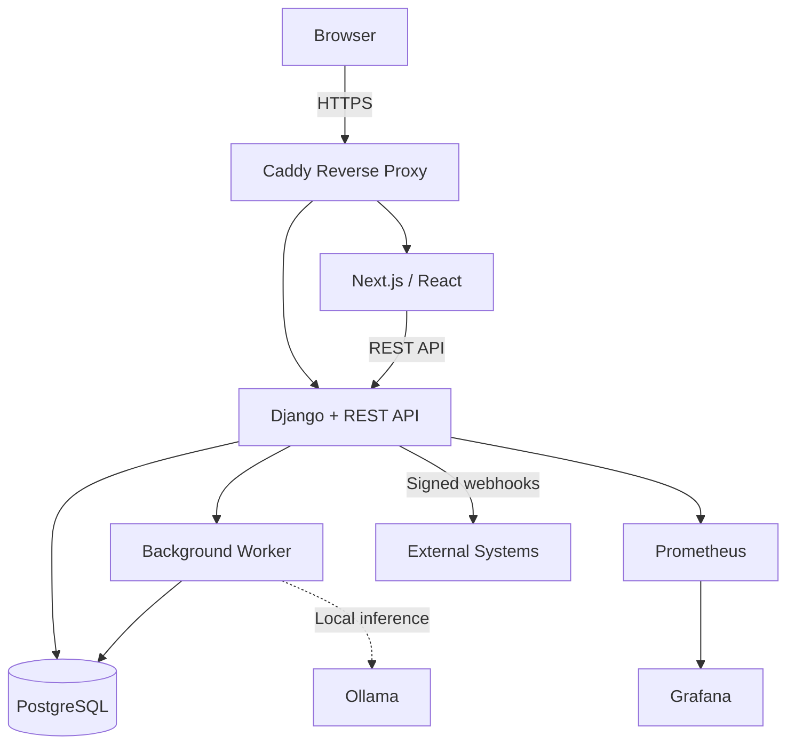

# CoreOps — Business Operations Platform

## Overview

CoreOps is a self-hosted, multi-tenant business operations platform designed to bring core business processes into a single system.

It covers HR, Purchasing, Quality Management, Non-Conformities/CAPA, IT Ticketing, Asset and Infrastructure Management, Meetings, Objectives (OKR), and Training.

The project addresses a common business problem: replacing spreadsheets and disconnected workflows with an integrated system that provides structured processes, traceability, automation, access control, and operational visibility.

CoreOps is an independent personal project developed and continuously operated by a single developer. It demonstrates end-to-end experience across business applications, backend and frontend development, automation, security, testing, CI/CD, and infrastructure.

The platform is currently undergoing an incremental frontend migration from a legacy Django interface to Next.js and React. All 9 business modules are currently available in the modern frontend.

---

## Key Capabilities

- **HR:** employee lifecycle, absences, time tracking, performance evaluations, skills matrix, labor-agreement categories and salary scales, and shift scheduling.
- **Purchasing:** purchase requests with configurable multi-level approvals, supplier quotes and evaluation, budgets, and delivery tracking.
- **Quality Management:** controlled documents, review and approval workflows, mandatory-reading tracking, audits, and risk management.
- **Non-Conformities / CAPA:** root-cause analysis, corrective action plans, effectiveness verification, and links to quality documents and audits.
- **IT Ticketing:** ITSM-style ticketing with SLA tracking, technician queues, satisfaction surveys, operational dashboards, and locally hosted AI-assisted triage.
- **Infrastructure & Assets:** asset registry, QR-code tagging, physical inventory audits, and operational status tracking.
- **Meetings:** agendas, action items, recurrence, formal meeting-minute PDF export, and calendar integration.
- **Objectives:** OKR-style objectives, progress check-ins, and budget linkage.
- **Training:** training records linked to employees and skills.
- **Reusable approval engine:** a generic multi-level approval system based on roles and thresholds, shared across multiple business modules.

---

## Architecture

CoreOps follows a modular monolith architecture. Business domains are separated into Django applications while sharing common services for tenants, organizations, activity logging, approvals, and integrations.

The frontend is being migrated incrementally from server-rendered Django views to Next.js and React. Both interfaces currently coexist while using the same backend and database.

---

## Technology Stack

### Backend

- Django 6.0
- Python 3.12
- Django REST Framework
- django-q2
- JWT authentication
- TOTP MFA
- SSO/OIDC

### Frontend

- Next.js 16
- React 19
- TypeScript
- Tailwind CSS v4
- shadcn/ui
- Zustand
- Recharts
- react-grid-layout

### Database

- PostgreSQL 16

### Infrastructure

- Docker Compose
- Caddy
- Linux
- Self-hosted infrastructure

### Testing & Quality

- Django unit and integration tests
- Playwright browser testing
- Vitest
- Testing Library
- Frontend E2E testing
- Automated accessibility testing with axe-core
- WCAG 2.2 AA checks
- Locust load testing
- Targeted mutation testing

### CI/CD

- Self-hosted Git with Actions-compatible CI
- Automated backend and frontend test gates
- E2E testing
- Accessibility checks
- Design-system consistency checks

### Observability

- Prometheus
- Grafana
- Health checks
- Scheduled alerting and process monitoring

### Security

- Multi-tenant data isolation
- Granular RBAC
- MFA
- SSO/OIDC
- SCIM provisioning
- Rate limiting
- Failed-login tracking
- Static analysis with Semgrep
- Signed outbound webhooks

### Other

- Installable PWA
- Locally hosted LLM with Ollama for AI-assisted ticket triage

---

## Engineering Highlights

### Multi-Tenant Architecture

CoreOps is designed around strict tenant isolation across business modules.

Tenant scoping is enforced consistently at the data-access layer and supported by automated security checks, reducing the risk of cross-tenant data exposure.

### Granular RBAC

Authorization uses a module-and-action permission model rather than broad administrator flags, allowing access to be controlled according to business responsibilities.

### Reusable Approval Engine

Approval workflows are implemented as a shared engine instead of being duplicated across individual modules.

The same architecture supports multi-level, threshold- and role-based approvals across different business processes.

### Secure Integrations

Outbound integrations use signed webhooks with retry handling through background processing.

### Testing Beyond Coverage Numbers

The project combines conventional unit and integration testing with real-browser testing, end-to-end testing, accessibility checks, load testing, and targeted mutation testing.

The goal is not simply to increase test counts, but to verify that tests detect meaningful regressions and boundary-condition failures.

### Accessibility as a CI Quality Gate

Automated WCAG 2.2 AA accessibility checks are integrated into the CI process rather than treated only as a manual review.

### Observability

Prometheus and Grafana provide infrastructure and business-level visibility, including operational metrics for areas such as tickets, objectives, procurement approvals, and non-conformities.

---

## Security

CoreOps implements multiple layers of protection appropriate for a multi-tenant business application, including:

- JWT-based authentication with MFA and SSO/OIDC support.
- Granular role-based authorization.
- Automated tenant-isolation checks.
- Separate credentials for external integrations.
- Rate limiting and failed-login tracking.
- HMAC-signed outbound webhooks.
- Security-focused static analysis with Semgrep.

Detailed implementation information that could expose internal security mechanisms is intentionally excluded from this public portfolio repository.

---

## Testing & Quality

The current codebase includes:

- **2,297 automated backend tests**, verified through test discovery.
- A substantial backend unit and integration test suite.
- Real-browser testing with Playwright for JavaScript-dependent behavior.
- Frontend unit testing with Vitest and Testing Library.
- Frontend E2E testing with Playwright.
- Automated accessibility testing.
- CI quality gates covering backend tests, frontend tests and builds, E2E testing, accessibility, and design-system consistency.
- Locust load testing for sustained concurrent workloads.
- Targeted mutation testing to verify the effectiveness of selected boundary-condition tests.

---

## Infrastructure & Deployment

CoreOps is operated as a self-hosted Docker Compose environment containing the application backend, background worker, frontend, PostgreSQL database, monitoring components, and reverse proxy.

The system includes scheduled database backups and a documented restore procedure.

Private network information, credentials, internal domains, production identifiers, and other operationally sensitive information are intentionally excluded from this public portfolio.

---

## AI-Assisted Development

CoreOps is developed using an AI-assisted workflow with Claude Code.

AI is used to accelerate implementation, testing, code review, and structured audit work.

The developer remains responsible for:

- Architecture and system design.
- Product and technical decisions.
- Data models and module boundaries.
- Security and multi-tenancy decisions.
- Reviewing generated implementations.
- Running and interpreting tests.
- Deciding what is accepted into the system.
- Operating and maintaining the resulting application.

Development follows a recurring **audit → implement → harden** process rather than treating AI-generated code as automatically correct.

The goal is to use AI as a development force multiplier while maintaining human ownership of architecture, correctness, security, and system quality.

---

## Project Scale

The following metrics are measured directly from the repository:

- **698 commits** across roughly three months of active development.
- **~38,100 lines** of backend application code, excluding migrations and tests.
- **~34,900 lines** of backend test code.
- **~20,980 lines** of frontend TypeScript/TSX.
- **250 database migrations.**
- **2,297 automated backend tests.**
- **11 Django applications**, including 9 business modules and shared core/accounts applications.

---

## Current Status

CoreOps is actively developed and self-hosted on the developer's own infrastructure.

All 9 business modules are functionally available in the modern frontend, while the legacy Django interface remains during the ongoing frontend migration.

The project is operated using production-oriented engineering practices, including automated testing, CI quality gates, monitoring, scheduled backups, and security checks.

CoreOps has not yet been deployed using a third-party company's live production data. It currently operates as an independent personal engineering and portfolio project.

---

## Portfolio Note

CoreOps is an independent personal project built to demonstrate practical, end-to-end experience in:

- Business software development
- Process automation
- Backend and frontend development
- Multi-tenant architecture
- Application security
- Automated testing
- CI/CD
- Observability
- Self-hosted infrastructure

The project reflects a hands-on approach to building and operating business systems rather than focusing only on isolated application development.

---

## Disclaimer

CoreOps is an independent personal project.

This public portfolio repository and its documentation do not contain confidential company information, real production data, proprietary source code belonging to an employer or third party, credentials, or private infrastructure details.

Any business processes represented in the project reflect general business-software requirements and do not disclose confidential information from any organization.

---

## About the Developer

I'm a Business Systems & Automation Developer with hands-on experience building and operating business applications, combining process automation, custom software development, and infrastructure management.

CoreOps reflects how I work: I make the architecture and technical decisions, use AI tooling to accelerate implementation, and remain personally accountable for correctness through code review, automated testing, security validation, and operating the system end to end.
